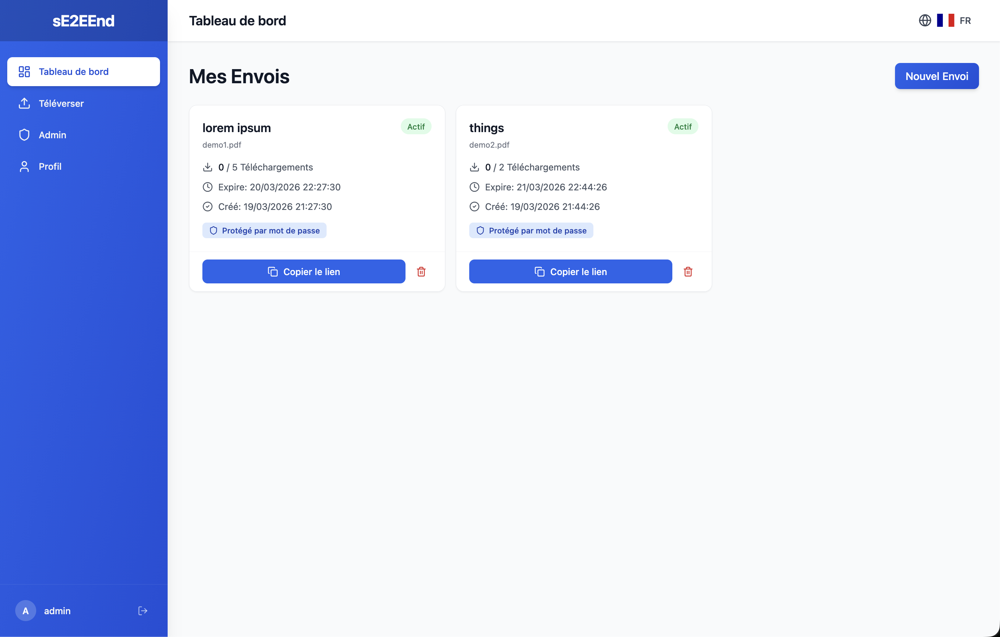
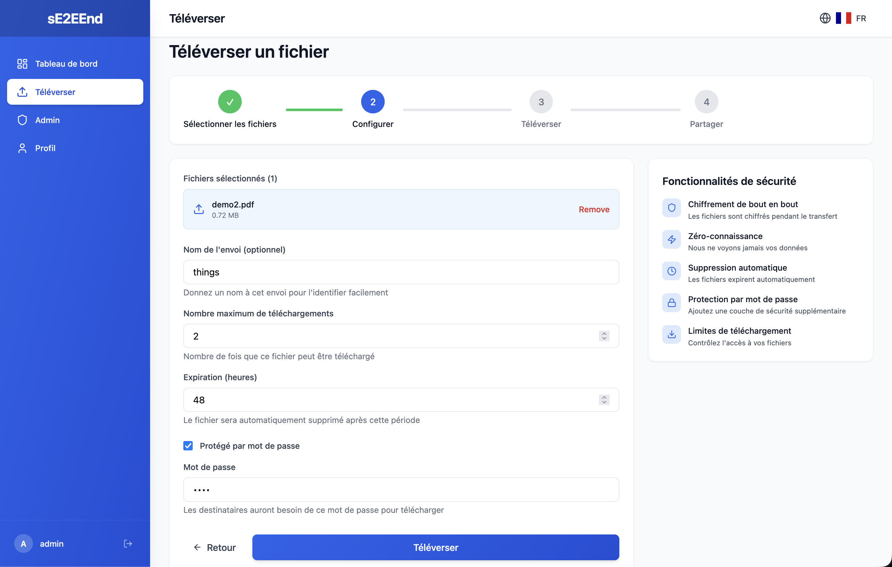
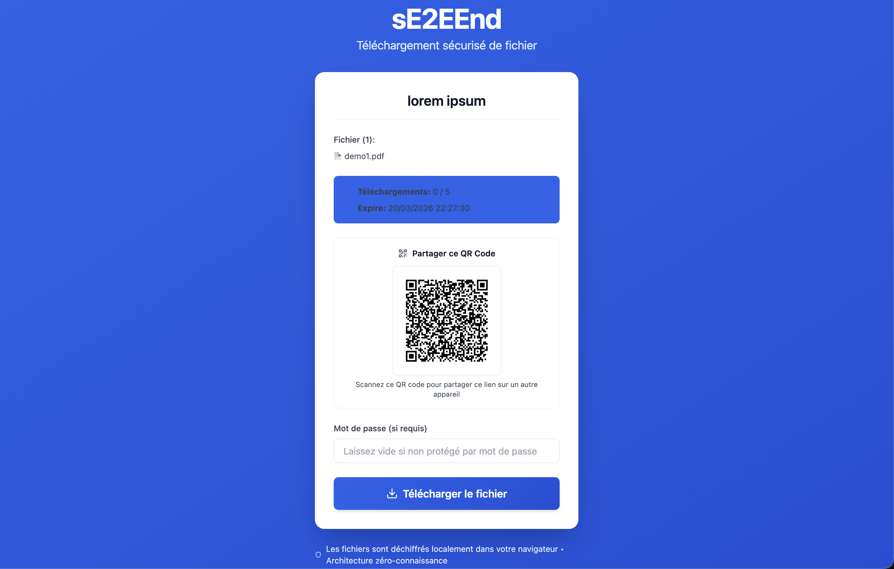
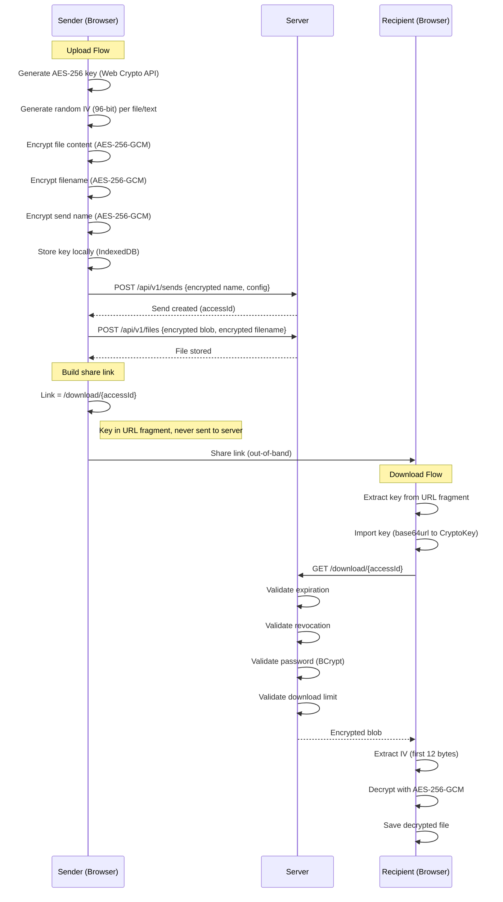

# sE2EEnd — E2EE File Transfer

**Self-hosted, end-to-end encrypted file sharing. The server never sees your keys.**

---

[](https://github.com/sE2EEnd/sE2EEnd/releases/latest)
[](https://github.com/sE2EEnd/sE2EEnd/blob/main/LICENSE)
[](https://github.com/sE2EEnd/sE2EEnd/commits/main)
[](https://github.com/sE2EEnd/sE2EEnd/issues)
[](https://github.com/sE2EEnd/sE2EEnd/blob/main/CONTRIBUTING.md)




<p align="center">
  
  
</p>

---

## Table of contents

- [Features](#features)
- [Architecture](#architecture)
- [Tech stack](#tech-stack)
- [Quick start](#quick-start)
- [Contributing](#contributing)
- [Security](#security)
- [License](#license)

---

## Features

- **End-to-end encryption** — Files are encrypted client-side before upload using AES-256-GCM via the Web Crypto API.
- **Zero-knowledge architecture** — The server never sees your encryption keys or plaintext data, even as an administrator.
- **Enterprise-grade auth** — Integrated with [Keycloak](https://github.com/keycloak/keycloak) for OAuth 2.0 / OpenID Connect. Supports federated identity providers (Google, etc.).
- **Password-protected sends** — Add an extra layer of security with a per-transfer password.
- **Granular download limits** — Control file distribution by setting a maximum download count.
- **Time-based auto-expiration** — Files are automatically deleted after a user-defined period.
- **Instant revocation** — Revoke access to any shared file at any time with a single click.

---

## Architecture

sE2EEnd uses **AES-256-GCM** encryption performed entirely in the browser via the [Web Crypto API](https://developer.mozilla.org/en-US/docs/Web/API/Web_Crypto_API). The encryption key lives in the URL fragment (`#key`) and is **never sent to the server**.



---

## Tech stack

| Layer | Technology |
|-------|-----------|
| Frontend | React, TypeScript, Tailwind CSS, Vite |
| Backend | Java 21, Spring Boot, Spring Security |
| Auth | Keycloak (OAuth 2.0 / OIDC) |
| Database | PostgreSQL |
| Encryption | AES-256-GCM via Web Crypto API |
| Infrastructure | Docker, Nginx |

---

## Quick start

### Prerequisites

- [Docker](https://docs.docker.com/get-docker/) and Docker Compose

### 1. Clone and configure

```bash
git clone https://github.com/sE2EEnd/sE2EEnd.git
cd sE2EEnd
cp .env.example .env
```

Edit `.env` to set your passwords and URLs (see [`.env.example`](.env.example) for all options).

### 2. Run

```bash
docker compose up -d
```

| Service | URL |
|---------|-----|
| Frontend | http://localhost |
| Backend API | http://localhost:8081 |
| Keycloak | http://localhost:8090 |

### Local development

To build from source instead of pulling images:

```bash
docker compose -f docker-compose.dev.yml up -d --build
```

Or run each service individually:

```bash
# Backend
cd backend && mvn spring-boot:run

# Frontend
cd frontend/core && npm install && npm run dev
```

---

## Contributing

Contributions are welcome! Please read [CONTRIBUTING.md](CONTRIBUTING.md) before opening a pull request.

For significant new features, open a [GitHub Discussion](https://github.com/sE2EEnd/sE2EEnd/discussions/new) first.

---

## Security

Please do not report security vulnerabilities through public GitHub issues. See [SECURITY.md](SECURITY.md) for the responsible disclosure process.

---

## License

Licensed under the [AGPL-3.0 License](LICENSE).