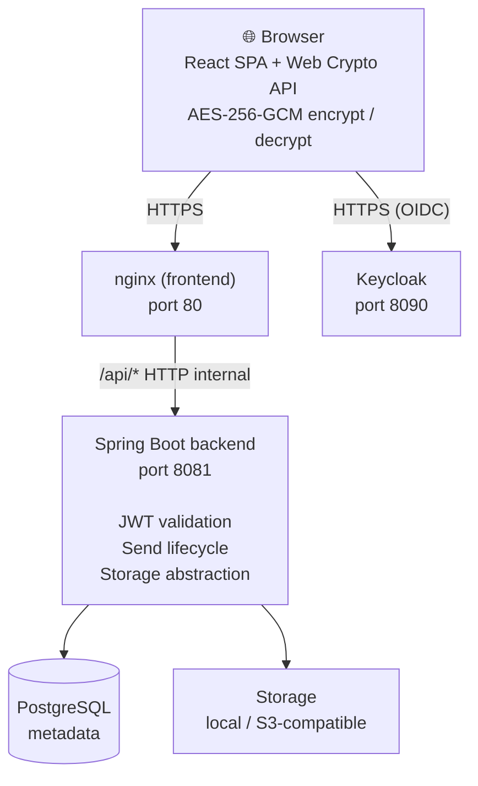
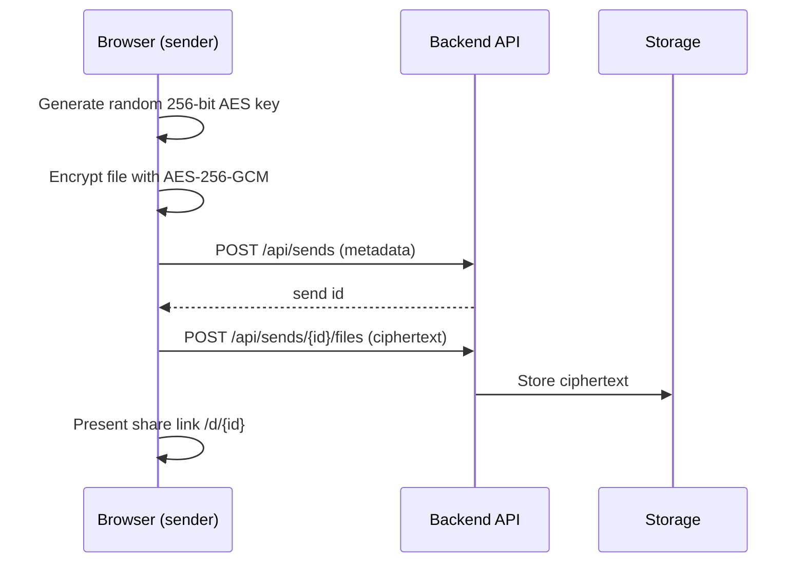
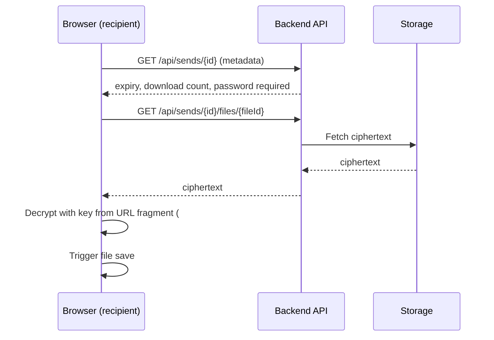
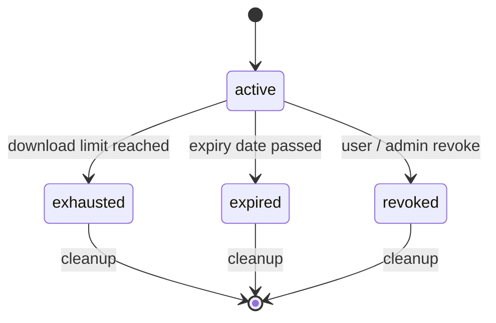

# Architecture

## Overview

sE2EEnd is a four-tier application: a React SPA served by nginx, a Spring Boot API, Keycloak for authentication, and PostgreSQL as the database. File storage is either local filesystem or S3-compatible.



## Encryption model

The encryption key is a random 256-bit value generated in the browser at upload time. It is:

- **Never sent to the server** — it lives only in the URL fragment (`#key`) which browsers do not include in HTTP requests
- Encoded as base64url in the share link: `https://your-domain.com/d/{send-id}#<base64url-key>`

The server stores and serves only ciphertext. Even with full database and storage access, an attacker cannot decrypt the files without the URL fragment.

### Upload flow



### Download flow



### Password protection

When a send is password-protected, the password is used server-side to gate the download — the server validates it before returning the ciphertext. The password is **not** used as or mixed with the encryption key.

## Backend

**Spring Boot 4** / Java 25, Maven multi-module build.

Key packages:

| Package      | Responsibility                                                                                     |
|--------------|----------------------------------------------------------------------------------------------------|
| `controller` | REST endpoints — `SendController`, `SendDownloadController`, `AdminController`, `ConfigController` |
| `service`    | Business logic — send lifecycle, download counting, cleanup scheduling                             |
| `storage`    | Storage abstraction — `LocalFileSystemStorage`, `S3FileStorage`                                    |
| `config`     | Spring Security (JWT), CORS (`WebConfig`), OpenAPI                                                 |
| `scheduler`  | `CleanupScheduler` — cron-based cleanup of expired/revoked/exhausted sends                         |
| `model`      | JPA entities — `Send`, `FileMetadata`, `DeletedSend`, `InstanceSetting`                            |

### Authentication

The backend validates JWT Bearer tokens issued by Keycloak. The `KeycloakJwtAuthenticationConverter` extracts realm roles from the `realm_access.roles` claim. The `admin` role is required for admin endpoints.

### Send lifecycle

A send transitions through these states:



All terminal states are eligible for cleanup. The cleanup scheduler (configurable cron, default: nightly at 2AM) deletes expired/revoked/exhausted sends and their files, and records them in the `DeletedSend` audit table.

## Frontend

**React 19** + **Vite 8** + **TypeScript 6**, served as a static SPA by nginx.

Key design points:

- **Runtime configuration** — Keycloak connection details are injected at container startup via `config.js` (no rebuild needed to change Keycloak URL/realm)
- **API proxy** — nginx forwards `/api/*` to the backend container, so the SPA only ever talks to its own origin (no CORS issues for the browser)
- **i18n** — `react-i18next` with EN and FR translation files

### Runtime config injection

At container startup, `docker-entrypoint.sh` writes `/usr/share/nginx/html/config.js`:

```js
window.__config = {
  keycloakUrl: "https://auth.your-domain.com",
  keycloakRealm: "se2eend",
  keycloakClientId: "se2eend-frontend"
};
```

This file is loaded by `index.html` before the SPA bundle, allowing Keycloak settings to be changed without rebuilding the image.

## Data model

```
Send
 ├── id (UUID)
 ├── name (encrypted, nullable)
 ├── type (FILE | TEXT)
 ├── status (active | revoked | expired | exhausted)
 ├── ownerId (Keycloak user ID)
 ├── passwordHash (bcrypt, nullable)
 ├── maxDownloads (nullable)
 ├── downloadCount
 ├── expiresAt (nullable)
 └── files[]
       ├── id (UUID)
       ├── originalName (encrypted)
       ├── storagePath
       └── size

InstanceSetting
 └── key / value pairs (requireAuthForDownload, cleanupSchedule, requireSendPassword, …)

DeletedSend  (audit log)
 └── id, name, size, reason (expired | revoked | exhausted | manual | user), deletedAt
```
