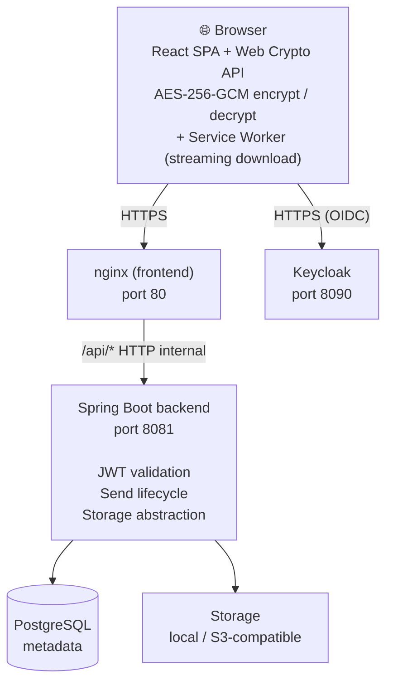
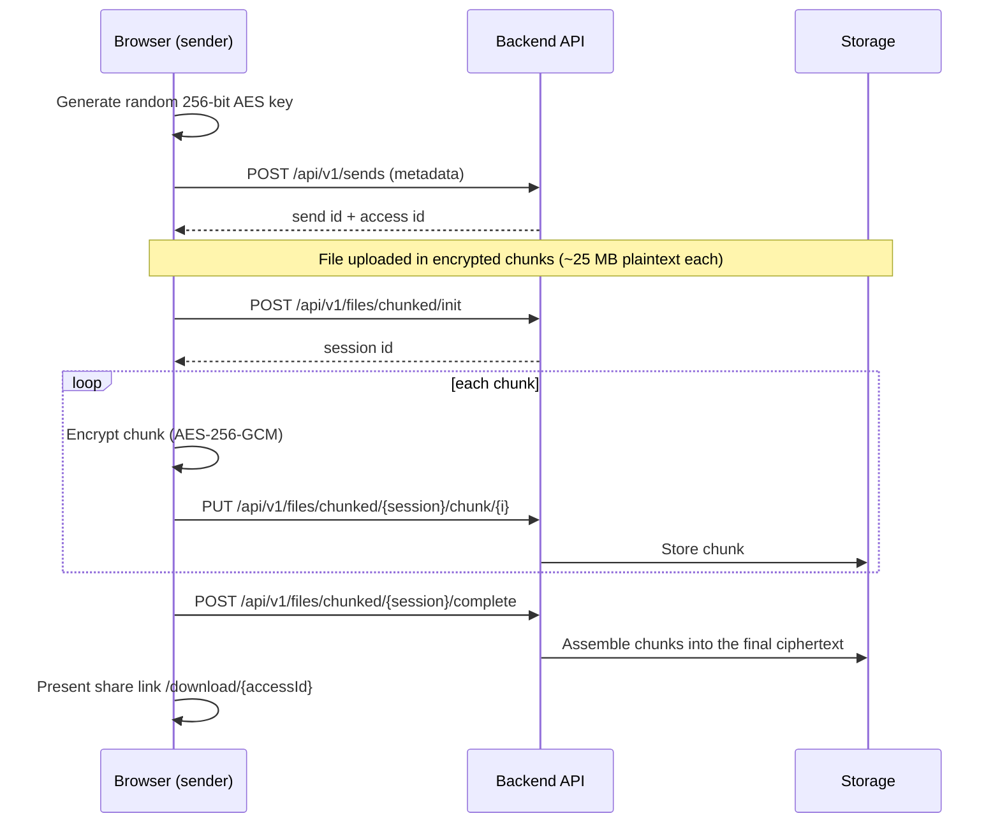
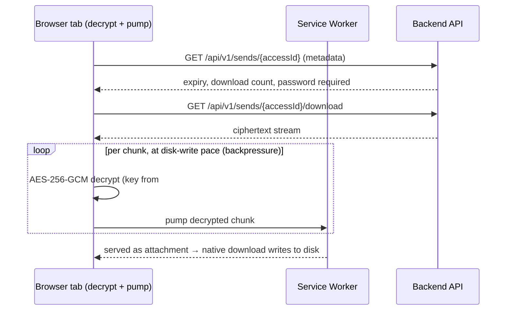
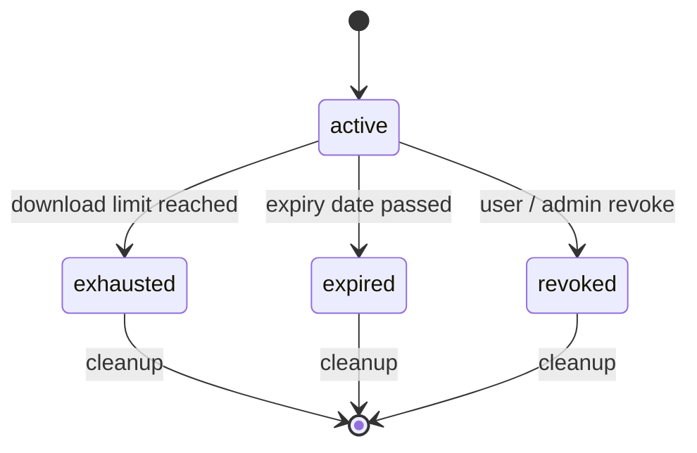

# Architecture

## Overview

sE2EEnd is a four-tier application: a React SPA served by nginx, a Spring Boot API, Keycloak for authentication, and PostgreSQL as the database. File storage is either local filesystem or S3-compatible.



## Encryption model

The encryption key is a random 256-bit value generated in the browser at upload time. It is:

- **Never sent to the server** — it lives only in the URL fragment (`#key`) which browsers do not include in HTTP requests
- Encoded as base64url in the share link: `https://your-domain.com/download/{accessId}#<base64url-key>`

The server stores and serves only ciphertext. Even with full database and storage access, an attacker cannot decrypt the files without the URL fragment.

### Upload flow



### Download flow



### Password protection

When a send is password-protected, the password is used server-side to gate the download — the server validates it before returning the ciphertext. The password is **not** used as or mixed with the encryption key.

## Large files

Files of any size (tested at 12 GB) are transferred without ever holding the whole file in memory — neither on the client nor on the server.

### Chunked upload

The browser streams the file slice by slice: each ~25 MB plaintext chunk is encrypted independently (`IV(12) + ciphertext + GCM tag(16)`) and `PUT` one at a time, with backpressure (a single chunk in flight). Multiple files are zipped on the fly (no compression) into a single stream. The backend stores each chunk, then concatenates them into one ciphertext object on `complete`.

- `POST /api/v1/files/chunked/init` → opens a session
- `PUT /api/v1/files/chunked/{session}/chunk/{i}` → stores one encrypted chunk
- `POST /api/v1/files/chunked/{session}/complete` → assembles the final object

The plaintext chunk size is recorded on the file metadata so the download can re-frame the stream. The upload size limit (`max_upload_size_bytes`, see [Instance Settings](./configuration/instance-settings)) is enforced **incrementally on every chunk, before anything is written to storage**.

### Streaming download

The recipient never buffers the whole file either:

```
fetch(...).body → re-chunk → AES-256-GCM decrypt → Service Worker → native download (disk)
```

A **same-origin service worker** (`/sw.js`) intercepts a magic URL and answers with a streamed `Response` carrying `Content-Disposition: attachment`, so the browser's native download manager writes to disk at the stream's pace — constant memory, any file size, on Chrome / Firefox / Safari. The page decrypts one chunk at a time and pumps it to the worker over a `MessageChannel` with backpressure; `event.waitUntil` keeps the worker alive for the whole transfer.

:::info E2EE preserved
The service worker only ever sees plaintext that was **already decrypted in the same browser** — nothing extra crosses the network, and the key still never leaves the URL fragment. The worker is same-origin and self-hosted (no third-party iframe).
:::

Browsers without service-worker support fall back to an in-memory download, guarded by a size limit.

## Backend

**Spring Boot 4** / Java 25, Maven multi-module build.

Key packages:

| Package      | Responsibility                                                                                                                                  |
|--------------|-------------------------------------------------------------------------------------------------------------------------------------------------|
| `controller` | REST endpoints — `SendController`, `SendDownloadController`, `ChunkedUploadController`, `FileController`, `AdminController`, `ConfigController` |
| `service`    | Business logic — send lifecycle, chunked upload & assembly, download counting, cleanup scheduling                                               |
| `storage`    | Storage abstraction — `LocalFileSystemStorage`, `S3FileStorage`                                                                                 |
| `config`     | Spring Security + CORS (`SecurityConfig`), JWT conversion, OpenAPI                                                                              |
| `scheduler`  | `CleanupScheduler` — cron cleanup of expired/revoked/exhausted sends + stale upload sessions                                                    |
| `model`      | JPA entities — `Send`, `FileMetadata`, `UploadSession`, `UploadChunk`, `DeletedSend`, `InstanceSetting`                                         |

### Authentication

The backend validates JWT Bearer tokens issued by Keycloak. The `KeycloakJwtAuthenticationConverter` extracts realm roles from the `realm_access.roles` claim. The `admin` role is required for admin endpoints.

### Send lifecycle

A send transitions through these states:



All terminal states are eligible for cleanup. The cleanup scheduler (configurable cron, default: nightly at 2AM — see [Instance Settings](./configuration/instance-settings)) deletes expired/revoked/exhausted sends and their files, prunes stale/abandoned upload sessions, and records deletions in the `DeletedSend` audit table.

## Frontend

**React 19** + **Vite 8** + **TypeScript 6**, served as a static SPA by nginx.

Key design points:

- **Runtime configuration** — Keycloak connection details are injected at container startup via `config.js` (no rebuild needed to change Keycloak URL/realm)
- **API proxy** — in the bundled deployment, nginx forwards `/api/*` to the backend container, so the SPA talks only to its own origin (no CORS). In split deployments (SPA and API on different origins) the backend's CORS config applies instead
- **Streaming download** — a same-origin service worker (`/sw.js`) streams large downloads straight to disk (see [Large files](#large-files))
- **i18n** — `react-i18next` with EN and FR translation files

### Runtime config injection

At container startup, `docker-entrypoint.sh` writes `/usr/share/nginx/html/config.js`:

```js
window.__config = {
  keycloakUrl: "https://auth.your-domain.com",
  keycloakRealm: "se2eend",
  keycloakClientId: "se2eend-frontend"
};
```

This file is loaded by `index.html` before the SPA bundle, allowing Keycloak settings to be changed without rebuilding the image.

## Data model

```
Send
 ├── id (UUID)
 ├── accessId (public share id, distinct from id)
 ├── name (encrypted, nullable)
 ├── type (FILE | TEXT)
 ├── ownerId / ownerName / ownerEmail (Keycloak user)
 ├── passwordProtected + passwordHash (bcrypt, nullable)
 ├── maxDownloads / downloadCount
 ├── expiresAt (nullable)
 ├── revoked (bool)            // "expired" / "exhausted" are derived at read time
 └── file (one, nullable)      // multiple files are zipped into a single object
       ├── id (UUID)
       ├── filename (encrypted)
       ├── storagePath (server-generated UUID)
       ├── sizeBytes
       └── chunkSize (plaintext chunk size — set for chunked uploads)

UploadSession  (transient, only during a chunked upload)
 ├── id (UUID) · send · filename (encrypted) · createdAt
 └── chunks[] → UploadChunk (id, chunkIndex, storagePath, sizeBytes)

InstanceSetting
 └── key / value pairs (max_upload_size_bytes, require_send_password,
                        require_auth_for_download, cleanup_cron)

DeletedSend  (audit log)
 └── id, name, size, reason (expired | revoked | exhausted | manual | user), deletedAt
```
